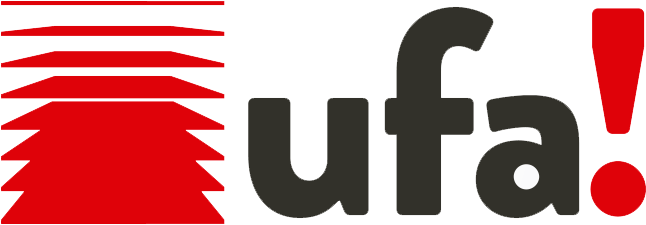

<!--
*** Thanks for checking out the Best-README-Template. If you have a suggestion
*** that would make this better, please fork the repo and create a pull request
*** or simply open an issue with the tag "enhancement".
*** Thanks again! Now go create something AMAZING! :D
-->

<!-- PROJECT SHIELDS -->
<!--
*** I'm using markdown "reference style" links for readability.
*** Reference links are enclosed in brackets [ ] instead of parentheses ( ).
*** See the bottom of this document for the declaration of the reference variables
*** for contributors-url, forks-url, etc. This is an optional, concise syntax you may use.
*** https://www.markdownguide.org/basic-syntax/#reference-style-links
-->


<!-- PROJECT LOGO -->
<br />
<p align="center">
  <a href="https://github.com/othneildrew/Best-README-Template">
    
  </a>

  <p align="center">
   Descomplique seu escritorio de advocacia.
    <br />
    <br />
    <a href="http://www.ufa.app.br/">View Live</a>

  </p>
</p>

<!-- TABLE OF CONTENTS -->
<details open="open">
  <summary>Table of Contents</summary>
  <ol>
    <li>
      <a href="#sobre-o-projeto">Sobre o projeto</a>
      <ul>
        <li><a href="#built-with">Built With</a></li>
      </ul>
    </li>
    <li>
      <a href="#getting-started">Getting Started</a>
      <ul>
        <li><a href="#prerequisites">Prerequisites</a></li>
        <li><a href="#installation">Installation</a></li>
      </ul>
    </li>
    <li><a href="#roadmap">Roadmap</a></li>
    <li><a href="#client">Client</a></li>
    <li><a href="#acknowledgements">Acknowledgements</a></li>
  </ol>
</details>

<!-- ABOUT THE PROJECT -->

## Sobre o projeto

[![Product Name Screen Shot][product-screenshot]](https://example.com)

Existem muitos sistemas de gestão voltados para o nicho de advocacia disponíveis no mercado, no entanto, não encontramos um que realmente atendesse às necessidades de pequenos escritórios, então criamos o UFA!

### Built With

- [Angular 11 ](https://angular.io/)

<!-- GETTING STARTED -->

## Getting Started

### Prerequisites

- npm

  ```sh
  npm install npm@latest -g
  ```

- angular
  ```sh
  npm install -g @angular/cli
  ```

### Installation

1. Clone the repo
   ```sh
   git clone https://github.com/UFAAPP/ufa-web.git
   ```
2. Install NPM packages
   ```sh
   npm install
   ```
3. Run
   ```sh
   ng serve --hmr
   ```

<!-- ROADMAP -->

## Roadmap

See the [open issues](https://github.com/UFAAPP/ufa-web/issues) for a list of proposed features (and known issues).

<!-- CONTACT -->

## Client

Bruno Vasconcelos - [@domvcelos](https://twitter.com/domvcelos) - domvcelos@gmail.com

Andre Marques - andreluis00@gmail.com

<!-- ACKNOWLEDGEMENTS -->

## Acknowledgements

- [Angular Material](https://material.angular.io/)
- [Ngx Avatar](https://www.npmjs.com/package/ngx-avatar)
- [Ngx Mask](https://www.npmjs.com/package/ngx-mask)
- [Ngx Toastr](https://www.npmjs.com/package/ngx-toastr)
- [Moment](https://momentjs.com/)

<!-- MARKDOWN LINKS & IMAGES -->
<!-- https://www.markdownguide.org/basic-syntax/#reference-style-links -->

[issues-shield]: https://img.shields.io/github/issues/othneildrew/Best-README-Template.svg?style=for-the-badge
[issues-url]: https://github.com/UFAAPP/ufa-web/issues
[product-screenshot]: src/assets/images/screenshot.png
